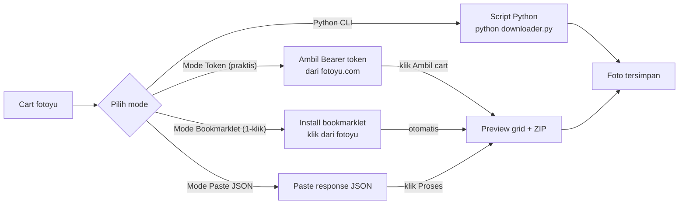
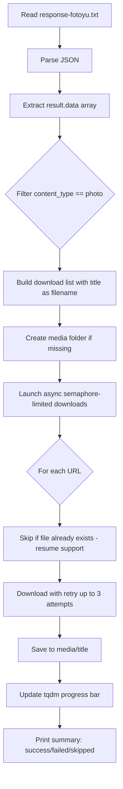

# Fotoyu Downloader

Fast concurrent downloader untuk foto dari [fotoyu.com](https://fotoyu.com).
Tersedia dalam dua bentuk:

1. **Script Python (CLI)** — `downloader.py`, jalankan di terminal.
2. **Web app (Next.js + Vercel)** — folder `web/`, buka di browser, gunakan
   salah satu dari 3 mode: Bookmarklet (1-klik dari fotoyu), Token (fetch otomatis),
   atau Paste JSON (manual) → download semua foto sebagai ZIP.

Keduanya membaca data cart dari fotoyu.com, mengekstrak semua URL foto, lalu
mengunduhnya secara concurrent.

---

## Daftar Isi

- [Fitur](#fitur)
- [Dua Cara Pakai](#dua-cara-pakai)
- [Cara Mendapatkan Response dari Fotoyu](#cara-mendapatkan-response-dari-fotoyu)
- [Opsi A: Web App](#opsi-a-web-app)
  - [Menjalankan Web App Lokal](#menjalankan-web-app-lokal)
  - [Deploy ke Vercel](#deploy-ke-vercel)
- [Opsi B: Script Python (CLI)](#opsi-b-script-python-cli)
  - [Requirements](#requirements)
  - [Instalasi](#instalasi)
  - [Cara Menjalankan](#cara-menjalankan)
  - [Opsi Command Line](#opsi-command-line)
- [Struktur Output](#struktur-output)
- [Cara Kerja](#cara-kerja)
- [Exit Codes](#exit-codes)
- [Troubleshooting](#troubleshooting)

---

## Fitur

### Web App (`web/`)
- **Tanpa install** — buka di browser, paste response, klik Proses.
- **3 mode penggunaan**:
  - **Token mode** — login dengan Bearer token, cart ter-fetch otomatis.
  - **Paste mode** — paste JSON response dari DevTools (cara lama).
  - **Bookmarklet mode** — 1 klik dari fotoyu.com langsung download (seamless).
- **Pratinjau thumbnail** semua foto sebelum download.
- **Search & filter** — cari foto berdasarkan nama file atau creator.
- **Bulk selection** — pilih foto tertentu untuk diunduh.
- **Download per foto** atau **download semua sebagai ZIP** (dibuat di browser).
- **Proxy server-side** untuk mengatasi CORS dari `cfsimgproxy.fototree.com`.
- **Progress bar** realtime saat membuat ZIP.
- **Dark mode** — toggle tema gelap/terang.
- **Drag & drop** file response langsung ke halaman.
- **Vercel Analytics** — tracking penggunaan (opsional, hanya di production).

### Script Python (`downloader.py`)
- **Download concurrent** menggunakan `asyncio` + `aiohttp` (default 10 paralel).
- **Resume support** — file yang sudah ada di-skip otomatis.
- **Retry otomatis** — hingga 3 percobaan per file dengan exponential backoff.
- **Atomic write** — tulis ke file `.part` dulu lalu rename, agar tidak ada
  file korup jika download terputik di tengah jalan.
- **Penamaan file cerdas** — menggunakan field `title` (mis. `ANN_7577.JPG`),
  di-sanitize untuk Windows, dengan deduplikasi nama otomatis.
- **Progress bar** `tqdm` + **laporan ringkasan** di akhir.
- **Filter** hanya `content_type == "photo"` dan dedupe URL yang sama.

---

## Dua Cara Pakai



- **Mode Bookmarklet** (paling praktis, baru) — install bookmarklet 1x, lalu tinggal
  klik dari halaman cart fotoyu. Cart langsung ter-load otomatis tanpa copy-paste.
- **Mode Token** (praktis) — ambil Bearer token sekali dari fotoyu, lalu cart langsung
  ter-fetch otomatis. Token disimpan di browser agar tidak perlu paste ulang.
- **Mode Paste JSON** (cara lama) — paste response JSON dari DevTools.
- **Script Python** — jika kamu sering download foto dan mau otomatisasi via terminal
  (lebih cepat untuk batch besar).

---

## Cara Mendapatkan Response dari Fotoyu

### Opsi A: Mode Bookmarklet (rekomendasi — paling praktis, 1 klik)

Mode ini tidak butuh copy-paste sama sekali. Install bookmarklet sekali, lalu
tinggal klik dari halaman cart fotoyu.

#### Cara install bookmarklet:

1. Buka web app fotoyu downloader (misalnya `https://fakyu.sayahafidz.my.id`).
2. Di halaman utama, pilih tab **"Bookmarklet"** atau **"Enhance"**.
3. Drag tombol bookmarklet ke bookmark bar browser kamu, atau klik kanan →
   **Add to bookmarks**.
4. Selesai! Bookmarklet sudah terinstall.

#### Cara pakai:

1. Buka [fotoyu.com](https://fotoyu.com), login, dan buka **cart** yang berisi
   foto-foto yang ingin kamu download.
2. Klik bookmarklet yang sudah kamu install di bookmark bar.
3. Browser akan otomatis membuka tab baru ke web app downloader dengan cart
   yang sudah ter-load. Tinggal klik **Download semua (ZIP)**.

> **Catatan:** Bookmarklet bekerja dengan mengambil data cart langsung dari
> halaman fotoyu (same-site fetch), jadi tidak perlu DevTools sama sekali.

---

### Opsi B: Mode Token (praktis — copy token 1x)

Mode ini hanya butuh Bearer token dari fotoyu. Setelah login di fotoyu.com,
copy token dari DevTools, paste ke web app, dan cart langsung ter-fetch.

1. Buka [fotoyu.com](https://fotoyu.com) di tab baru dan **login**.
2. Pilih foto-foto di aplikasi fotoyu, tambahkan ke **keranjang (cart)**.
3. Di tab fotoyu.com, tekan `F12` → buka tab **Application**.
4. Sidebar kiri: **Storage** → **Local Storage** → **https://fotoyu.com**.
5. Cari key `persist:root`, klik kanan → **Copy** value-nya (seluruh JSON string).
6. Paste ke web app (tab Token) → klik **Ambil cart**.

Token biasanya berlaku beberapa jam. Jika expired, ambil token baru.

---

### Opsi C: Paste JSON response (cara lama, tetap tersedia)

Script Python maupun Web App (mode paste) butuh JSON response dari endpoint
cart preview fotoyu. Berikut langkah mendapatkannya:

### Langkah 1 — Pilih foto di aplikasi fotoyu

1. Buka aplikasi **fotoyu** (mis. dari `ancodebuddy/io`).
2. Pilih foto-foto yang ingin kamu download.
3. Tambahkan foto-foto tersebut ke **keranjang (cart)**.

### Langkah 2 — Buka web fotoyu dari laptop

1. Buka browser (Chrome / Edge) di laptop.
2. Aktifkan **mode tampilan HP (mobile mode)** lewat DevTools:
   - Tekan `F12` untuk membuka DevTools.
   - Klik icon **Toggle device toolbar** (Ctrl+Shift+M) untuk beralih ke
     tampilan mobile.
3. Kunjungi `https://fotoyu.com`.
4. **Login** dengan akun yang sama dengan yang kamu pakai di aplikasi.

### Langkah 3 — Buka cart dan tangkap response API

1. Dengan DevTools masih terbuka, buka **cart / keranjang** yang berisi
   foto-foto yang sudah kamu pilih.
2. Di DevTools, buka tab **Network**.
3. Filter dengan **Fetch/XHR**.
4. Cari request dengan URL:
   ```
   https://api.fotoyu.com/gs/v1/carts/preview
   ```
   > Tips: pakai kotak filter dan ketik `carts/preview` untuk mempersempit
   > pencarian. Klik request-nya untuk membuka panel detail.

### Langkah 4 — Salin response

1. Pada panel detail request, buka tab **Response** (atau **Preview**).
2. Salin seluruh isi response (berupa JSON) — klik kanan → **Copy response**,
   atau salin manual teks JSON-nya.

Setelah itu:
- **Web App (mode paste)**: paste langsung ke kotak textarea → klik Proses.
- **Script Python**: paste ke file `response-fotoyu.txt` di folder project.

Struktur response harus seperti ini (ringkas):

```json
{
  "result": {
    "data": [
      {
        "product_id": "...",
        "title": "ANN_7577.JPG",
        "url": "https://cfsimgproxy.fototree.com/.../....jpeg",
        "content_type": "photo",
        ...
      },
      ...
    ]
  },
  "message": "OK"
}
```

---

## Opsi A: Web App

Web app berada di folder `web/`. Dibangun dengan Next.js 16 + TypeScript +
Tailwind CSS, dan di-deploy ke Vercel. Tidak perlu Python.

### Fitur Web App

- **3 mode:** Bookmarklet (1-klik), Token (fetch otomatis), Paste JSON (manual)
- **Search & filter:** Cari foto by filename atau creator name
- **Bulk selection:** Pilih foto tertentu untuk diunduh
- **Dark mode:** Toggle tema gelap/terang
- **Responsive:** Desktop & mobile friendly
- **Vercel Analytics:** Tracking penggunaan (opsional, production only)

### Menjalankan Web App Lokal

```powershell
cd web
npm install
npm run dev
```

Buka `http://localhost:3000` di browser. Pilih salah satu mode:

**Mode Bookmarklet (paling praktis):**
1. Install bookmarklet dari tab "Enhance/Bookmarklet"
2. Buka fotoyu.com, masuk ke cart
3. Klik bookmarklet → otomatis membuka downloader dengan cart ter-load

**Mode Token (praktis):**
1. Copy `persist:root` dari Local Storage fotoyu.com (F12 → Application)
2. Paste ke kotak token → klik **Ambil cart**
3. Preview foto muncul → pilih foto atau klik **Download semua (ZIP)**

**Mode Paste JSON (manual):**
1. Copy response JSON dari DevTools (Network → `carts/preview`)
2. Paste ke kotak besar atau drag & drop file `response-fotoyu.txt`
3. Klik **Proses** → preview muncul → download

> **Fitur tambahan:** Gunakan **search box** untuk filter foto, **checkbox** untuk
> pilih foto tertentu, dan **dark mode toggle** (pojok kanan atas) untuk kenyamanan mata.

### Deploy ke Vercel

1. Push repo ini ke GitHub (sudah ada di
   `https://github.com/sayahafidz/fotoyu-downloader`).
2. Buka [vercel.com](https://vercel.com) → **Add New Project** → import repo
   `sayahafidz/fotoyu-downloader`.
3. Di pengaturan project:
   - **Root Directory**: ubah ke `web`
   - **Framework Preset**: Next.js (terdeteksi otomatis)
   - **Build Command**: `npm run build` (default)
   - **Install Command**: `npm install` (default)
4. Klik **Deploy**. Selesai dalam ~1 menit.

> **Catatan untuk Vercel:** CDN `cfsimgproxy.fototree.com` memblokir IP
> datacenter Vercel. Proxy preview dan ZIP download mungkin tidak berfungsi.
> Untuk fitur penuh (proxy + ZIP), deploy di server sendiri (lihat
> [Deploy dengan Docker](#deploy-dengan-docker) di bawah).

### Deploy dengan Docker (rekomendasi — semua fitur jalan)

Deploy di VPS sendiri (DigitalOcean, Vultr, Linode, dll) agar proxy jalan 100%
dan ZIP download berfungsi. VPS Indonesia biasanya tidak di-block oleh CDN fotoyu.

#### Requirements di VPS

- Docker & Docker Compose (v2)
- Domain yang A/AAAA DNS-nya sudah pointing ke IP VPS
- Port 80 & 443 terbuka di firewall

#### Langkah deploy

```bash
# 1. Clone repo di VPS
git clone https://github.com/sayahafidz/fotoyu-downloader.git
cd fotoyu-downloader/web

# 2. Setup env
cp .env.example .env
# Edit .env — set NEXT_PUBLIC_APP_URL ke domain kamu,
# dan APP_DOMAIN juga ke domain kamu (untuk Caddy).

# 3. Edit Caddyfile — ganti fotoyu.example.com dengan domain kamu.

# 4. Build & jalankan
docker compose up -d --build
```

Setelah itu web app bisa diakses di `https://domain-kamu.com`. Caddy
otomatis mengambil sertifikat SSL dari Let's Encrypt.

#### Update / redeploy

```bash
cd fotoyu-downloader/web
git pull
docker compose up -d --build
```

#### Arsitektur Docker

```mermaid
flowchart LR
    Internet[Internet] -->|"HTTPS :443"| Caddy[Caddy reverse proxy]
    Caddy -->|"proxy_pass web:3000"| NextJS[Next.js container]
    NextJS -->|"fetch (server-side)"| CDN[cfsimgproxy.fototree.com]
    NextJS -->|"API calls"| API[api.fotoyu.com]
``

- **Caddy**: reverse proxy + auto HTTPS (Let's Encrypt). Cache response proxy.
- **Next.js**: standalone build, user `nextjs` non-root.
- **Network**: internal bridge, hanya Caddy yang exposed ke internet.

---

## Opsi B: Script Python (CLI)

### Requirements

- Python 3.10 atau lebih baru
- `aiohttp`
- `tqdm`

Semua dependency sudah disediakan via virtual environment (lihat Instalasi).

### Instalasi

Project ini sudah memiliki virtual environment (`.venv`) yang siap pakai.
Ikuti langkah berikut untuk mulai menggunakannya.

### 1. Buat dan aktivasi venv (jika belum ada)

Jika folder `.venv` sudah ada, lewati langkah pembuatan.

**Buat venv baru (Python 3.10+):**

```powershell
py -3.12 -m venv .venv
```

**Aktivasi venv:**

```powershell
# Windows PowerShell
.\.venv\Scripts\Activate.ps1

# Windows CMD
.\.venv\Scripts\activate.bat
```

Setelah aktif, prompt akan berubah menjadi `(.venv) ...`.

> Jika PowerShell menolak menjalankan `Activate.ps1` karena execution policy,
> jalankan sekali:
> ```powershell
> Set-ExecutionPolicy -Scope CurrentUser -ExecutionPolicy RemoteSigned
> ```

### 2. Install dependencies ke venv

```powershell
# Pastikan venv sudah aktif, lalu:
python -m pip install -r requirements.txt
```

Atau tanpa aktivasi venv, panggil python venv langsung:

```powershell
.\.venv\Scripts\python.exe -m pip install -r requirements.txt
```

---

## Cara Menjalankan

### Opsi A — Pakai venv langsung (paling sederhana)

```powershell
.\.venv\Scripts\python.exe downloader.py
```

### Opsi B — Aktivasi venv dulu lalu jalankan

```powershell
# Aktivasi venv (sekali per session terminal)
.\.venv\Scripts\Activate.ps1

# Setelah aktif, jalankan script dengan python biasa
python downloader.py
```

Script akan:
1. Membaca `response-fotoyu.txt`.
2. Mengekstrak semua URL foto dari `result.data[]`.
3. Mengunduh semua foto secara concurrent ke folder `media/`.

Contoh output:

```
Input:       D:\PYTHON PROJECT\fotoyu downloader\response-fotoyu.txt
Output dir:  D:\PYTHON PROJECT\fotoyu downloader\media
Concurrency: 10
Found 34 items, 34 downloadable images.

Downloading: 100%|##########| 34/34 [00:00<00:00, 38.82file/s]

==================================================
Download summary
==================================================
  Total:     34
  Success:   34
  Skipped:   0 (already existed)
  Failed:    0
  Downloaded:4.90 MB
```

---

## Opsi Command Line

| Flag            | Short | Default              | Deskripsi |
|-----------------|-------|----------------------|-----------|
| `--input`       | `-i`  | `response-fotoyu.txt`| Path file response JSON |
| `--output`      | `-o`  | `media`              | Folder tujuan download |
| `--concurrency` | `-c`  | `10`                 | Jumlah download paralel |

### Contoh

Download dengan default:

```powershell
.\.venv\Scripts\python.exe downloader.py
```

Custom input/output dan 20 download paralel:

```powershell
.\.venv\Scripts\python.exe downloader.py -i response-fotoyu.txt -o media -c 20
```

Pakai venv yang sudah aktif:

```powershell
python downloader.py -c 20
```

---

## Struktur Output

```
fotoyu downloader/
├── .venv/                  # virtual environment Python (tidak perlu disentuh)
├── response-fotoyu.txt     # file response JSON (di-paste dari DevTools)
├── downloader.py           # script Python utama (Opsi B)
├── requirements.txt        # daftar dependency Python
├── README.md               # file ini
├── web/                    # Next.js web app (Opsi A)
│   ├── app/                # halaman + API routes
│   ├── components/         # komponen React
│   ├── lib/                # parser + download helper
│   └── package.json
└── media/                  # folder hasil download Python (dibuat otomatis)
    ├── ANN_7577.JPG
    ├── ANN_7583.JPG
    ├── AFR_7096.JPG
    └── ...
```

Foto disimpan dengan nama sesuai field `title` dari response (nama asli
foto saat diupload). Jika ada nama yang sama, suffix `_2`, `_3`, dst.
ditambahkan otomatis.

---

## Cara Kerja



1. Membaca dan parse JSON response.
2. Iterasi `result.data[]`, hanya ambil item dengan `content_type == "photo"`
   dan memiliki `url` valid.
3. Bangun daftar download yang sudah didedupe dengan nama file aman & unik.
4. Jalankan download concurrent dibatasi oleh `asyncio.Semaphore`.
5. Stream tiap response ke file `.part` lalu rename secara atomik saat sukses.
6. Retry hingga 3x dengan exponential backoff untuk download yang gagal.
7. Cetak ringkasan akhir (success / skipped / failed / total bytes).

---

## Exit Codes

- `0` — semua download sukses (atau di-skip karena sudah ada).
- `1` — file input tidak ditemukan atau JSON tidak valid.
- `2` — satu atau lebih download gagal setelah retry.

---

## Troubleshooting

### `ModuleNotFoundError: No module named 'aiohttp'`

Venv belum aktif atau dependency belum terinstall. Jalankan:

```powershell
.\.venv\Scripts\python.exe -m pip install -r requirements.txt
```

Atau pastikan venv sudah diaktivasi sebelum memanggil `python`.

### `python downloader.py` error tapi `py -3.12` berhasil

Sistem punya beberapa Python terinstall. Selalu pakai venv project agar
dependency konsisten:

```powershell
.\.venv\Scripts\python.exe downloader.py
```

### Download gagal semua / HTTP 403

Response URL mungkin sudah expired atau butuh header tertentu. Pastikan:
1. Response diambil dari session yang **sudah login**.
2. Ambil response **segar** dari cart preview (jangan pakai response lama
   berhari-hari).

### `Activate.ps1 cannot be loaded because running scripts is disabled`

Jalankan sekali di PowerShell:

```powershell
Set-ExecutionPolicy -Scope CurrentUser -ExecutionPolicy RemoteSigned
```

### Foto tidak terdownload semua

- Pastikan field `content_type` di item adalah `"photo"` (bukan video).
- Pastikan field `url` ada dan tidak kosong.
- Cek laporan ringkasan — bagian "Failed" menampilkan nama file yang gagal.

### Mau download ulang dari awal

Hapus folder `media` lalu jalankan ulang script:

```powershell
Remove-Item -Recurse -Force media
.\.venv\Scripts\python.exe downloader.py
```

---

## Troubleshooting Web App

### Token tidak valid / expired (HTTP 401)

Token Bearer dari `persist:root` biasanya berlaku beberapa jam. Jika muncul error
"Token tidak valid atau sudah expired":

1. Refresh halaman fotoyu.com dan login ulang jika perlu
2. Ambil `persist:root` baru dari DevTools → Application → Local Storage
3. Paste token baru ke web app

### Bookmarklet tidak bekerja

Jika bookmarklet tidak membuka tab baru atau error:

1. Pastikan kamu sedang di halaman **cart** fotoyu.com (bukan halaman lain)
2. Pastikan kamu sudah **login** di fotoyu.com
3. Clear cache browser dan coba lagi
4. Coba gunakan mode Token sebagai alternatif

### Preview foto tidak muncul / CORS error

Jika preview thumbnail tidak muncul (gambar broken):

- **Di Vercel:** CDN `cfsimgproxy.fototree.com` sering memblokir IP datacenter.
  Solusi: deploy di VPS sendiri dengan Docker (lihat section Deploy dengan Docker).
- **Di localhost:** Seharusnya tidak ada masalah CORS. Pastikan dev server berjalan.

### ZIP download gagal / stuck

Jika download ZIP tidak jalan atau stuck di progress bar:

1. Coba download per foto dulu untuk verifikasi koneksi
2. Gunakan browser modern (Chrome, Edge, Firefox terbaru)
3. Disable extension browser yang mungkin block download (adblocker, dll)
4. Coba dengan jumlah foto lebih sedikit dulu (pilih beberapa foto via checkbox)

### Bookmarklet mengatakan "Cart kosong"

Pastikan:
1. Kamu sudah menambahkan foto ke cart di fotoyu.com
2. Halaman cart sudah fully loaded sebelum klik bookmarklet
3. Coba refresh halaman cart lalu klik bookmarklet lagi
