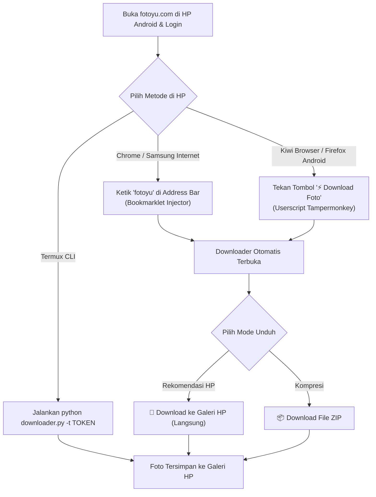

# Fotoyu Downloader (Android & Web & CLI)

Fast concurrent downloader untuk foto resolusi tinggi dari [fotoyu.com](https://fotoyu.com).
Tersedia dalam dua bentuk utama:

1. **Web App & PWA (Next.js)** — folder `web/`, buka di browser HP Android / PC atau pasang sebagai aplikasi (PWA):
   - **Mode 1-Klik (Bookmarklet / Userscript)**: 1 klik langsung dari fotoyu.com di HP Android maupun PC.
   - **Mode Token**: Login dengan Bearer token / `persist:root` (tersimpan otomatis di browser).
   - **Mode Paste JSON**: Paste manual respon API jika diinginkan.
   - **Download Mode**: Simpan langsung ke folder **Galeri/Download HP** (tanpa ribet ekstrak ZIP) atau unduh sebagai **File ZIP**.
2. **Script Python (CLI & Termux Android)** — `downloader.py`, jalankan di terminal PC atau Termux di HP Android dengan multi-threading super cepat.

---

## 📱 Panduan Penggunaan di HP Android (Tanpa Laptop/PC)

Kamu sekarang bisa mendownload foto langsung dari smartphone Android tanpa butuh laptop sama sekali!


```mermaid
flowchart TD
    A[Buka fotoyu.com di HP Android & Login] --> B{Pilih Metode di HP}
    B -->|Chrome / Samsung Internet| C["Ketik 'fotoyu' di Address Bar<br/>(Bookmarklet Injector)"]
    B -->|Kiwi Browser / Firefox Android| D["Tekan Tombol '⚡ Download Foto'<br/>(Userscript Tampermonkey)"]
    B -->|Termux CLI| E["Jalankan python downloader.py -t TOKEN"]
    C --> F[Downloader Otomatis Terbuka]
    D --> F
    E --> G[Foto Tersimpan ke Galeri HP]
    F --> H{Pilih Mode Unduh}
    H -->|Rekomendasi HP| I["📱 Download ke Galeri HP (Langsung)"]
    H -->|Kompresi| J["📦 Download File ZIP"]
    I --> G
    J --> G
```

### Opsi 1: Google Chrome & Samsung Internet (Address Bar Bookmarklet)
1. Buka Web App Fotoyu Downloader di HP (`https://fakyu.sayahafidz.my.id`).
2. Salin kode **Bookmarklet Android**:
   ```javascript
   javascript:(function(){var s=document.createElement('script');s.src='https://fakyu.sayahafidz.my.id/android-inject.js?t='+Date.now();document.body.appendChild(s);})();
   ```
3. Di Chrome HP: Simpan sembarang halaman ke Bookmark (Tekan ⋮ → ★), lalu **Edit Bookmark**:
   - Nama: `fotoyu`
   - URL: Paste kode di atas.
4. Buka **fotoyu.com**, pastikan sudah login dan foto sudah masuk keranjang.
5. Ketik `fotoyu` di Address Bar Chrome → Ketuk bookmark yang muncul.
6. Halaman akan otomatis mengambil keranjang dan membuka fotoyu-downloader!

---

### Opsi 2: Kiwi Browser / Firefox Android (Tombol Mengambang 1-Klik)
1. Pasang ekstensi **Tampermonkey** atau **Violentmonkey** di Kiwi Browser / Firefox Android.
2. Pasang Userscript Fotoyu dengan 1-klik:
   - Buka: `https://fakyu.sayahafidz.my.id/fotoyu-mobile-helper.user.js`
3. Saat kamu membuka `fotoyu.com`, tombol mengambang **"⚡ Download Foto"** akan otomatis muncul di pojok kanan bawah layar HP kamu!

---

### Opsi 3: Termux di Android (CLI Ultra Cepat)
Untuk pengguna Android mahir yang ingin kecepatan maksimal:
```bash
# 1. Update package & install git + python
pkg update && pkg install python git -y

# 2. Clone repo & install dependency
git clone https://github.com/sayahafidz/fotoyu-downloader.git
cd fotoyu-downloader
pip install -r requirements.txt

# 3. Jalankan langsung dengan token atau response
python downloader.py --token "TOKEN_FOTOYU_KAMU"
```
Foto akan otomatis tersimpan langsung ke folder Download HP (`~/storage/downloads/Fotoyu` atau `./media`).

---

## 🚀 Fitur Utama & Superpowers Baru

### Web App & PWA (`web/`)
- **PWA (Progressive Web App)** — Pasang langsung di layar utama HP Android layaknya aplikasi native.
- **Dua Pilihan Download**:
  - **📱 Galeri HP (Langsung)**: Unduh foto berurutan langsung ke folder Download/Galeri smartphone tanpa beban RAM dan tanpa perlu aplikasi unzip.
  - **📦 File ZIP**: Kompresi instan semua foto dalam satu file ZIP di browser.
- **✨ In-Browser Canvas Auto-Tone & Vibrance Engine**: Peningkatan kontras, saturasi warna, dan pemulihan artefak pelangi (*rainbow streak healer*) secara offline langsung di browser tanpa butuh API Key.
- **📸 Smart Creator Filter Chips**: Pengelompokan foto otomatis berdasarkan nama fotografer dengan chip filter 1-ketuk.
- **🗂️ Folder-Organized ZIP Export**: Merapikan file ZIP ke dalam subfolder otomatis per nama fotografer (`/Fotografer_A/img.jpg`).
- **↔️ Interactive Before/After Split Slider**: Geser perbandingan foto *Sebelum vs Sesudah* secara real-time di Lightbox layar penuh.
- **Web Share Target API** — Share foto langsung ke WhatsApp, Google Photos, Google Drive, atau File Manager Android.
- **Touch Swipe Lightbox** — Geser layar (swipe left/right) untuk navigasi foto di HP, swipe down untuk menutup, dan tap zoom.
- **Sticky Bottom Action Bar** — Tombol aksi di area bawah jempol (*thumb zone*) khusus tampilan mobile.
- **Penghapus Watermark AI** — Opsi pembersih watermark berbasis AI terintegrasi (Google Gemini 2.0 Flash Free & Dewatermark.ai).
- **Dark Mode 100%** — Dukungan tema gelap otomatis dan manual dengan palet warna kontras tinggi.

### Script Python (`downloader.py`)
- **Direct Token Fetching (`--token`)** — Ambil cart langsung dari API tanpa perlu menyalin file JSON.
- **Auto Termux Storage Detection** — Mendeteksi folder Download Android otomatis saat dijalankan di Termux.
- **Multi-threaded Asynchronous** — 10-20 unduhan paralel bersamaan dengan `asyncio` + `aiohttp`.
- **Atomic File Writing** — Tulis file `.part` terlebih dahulu untuk mencegah file rusak/korup.
- **Resume & Retry Support** — Otomatis melewati file yang sudah ada dan melakukan retry otomatis saat jaringan lambat.

---

## 💻 Cara Menjalankan

### Web App (Lokal & Deploy)
```bash
cd web
npm install
npm run dev
```
Buka `http://localhost:3000` di browser HP atau PC.

### Python CLI (Lokal & Termux)
```bash
# Jalankan dengan token langsung
python downloader.py --token "ey..."

# Atau jalankan dengan file JSON
python downloader.py --input response-fotoyu.txt --concurrency 10
```

---

## 🛠️ Struktur Project

```
fotoyu-downloader/
├── downloader.py             # Script Python CLI & Termux Android
├── requirements.txt          # Dependency Python (aiohttp, tqdm)
├── README.md                 # Dokumentasi lengkap
└── web/                      # Aplikasi Web & PWA Next.js 16
    ├── app/
    │   ├── layout.tsx        # PWA & Service Worker meta
    │   ├── page.tsx          # Halaman utama aplikasi
    │   ├── manifest.ts       # PWA Web Manifest
    │   └── api/              # API Proxy, Cart, Watermark removal
    ├── components/
    │   ├── PhotoGrid.tsx     # Grid foto + Mobile Sticky Bottom Bar
    │   ├── PhotoCard.tsx     # Kartu foto + Web Share API
    │   ├── Lightbox.tsx      # Touch-swipe gesture lightbox
    │   ├── AndroidGuideModal.tsx # Panduan interaktif visual Android
    │   ├── PwaInstallBanner.tsx  # Banner pasang aplikasi di HP
    │   ├── BookmarkletSection.tsx# 1-Klik Android & Desktop
    │   └── ...
    ├── lib/
    │   ├── download.ts       # Engine download: Direct Sequential, ZIP, Web Share
    │   ├── parse.ts          # Ekstraktor dan sanitizer nama file
    │   └── session.ts        # Penyimpanan token lokal
    └── public/
        ├── manifest.json     # PWA manifest
        ├── sw.js             # Service worker PWA
        ├── android-inject.js # Script injeksi otomatis di HP
        └── fotoyu-mobile-helper.user.js # Userscript Tampermonkey HP
```

---

## 📜 Lisensi & Penggunaan
Dibuat untuk mempermudah backup foto dokumentasi pribadi. Bukan berafiliasi resmi dengan fotoyu.com. Gunakan dengan bijak untuk foto milikmu sendiri.
